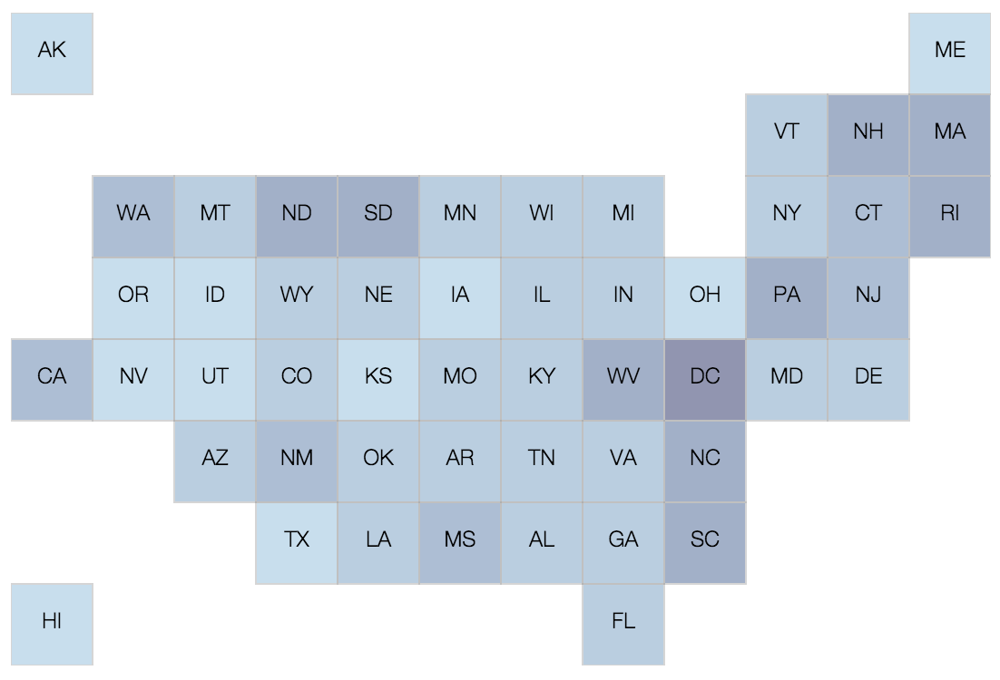

# gridmap-layout-usa

Positions of tiles for US grid map visualization.

<p align="center">
  
</p>

### Install

```
npm install gridmap-layout-usa --save
```

or

```
bower install gridmap-layout-usa --save
```

The data files can be found in the ```dist``` directory of the installed package. Either one of these files below can be used:

- dist/gridmap-layout-usa.json
- dist/gridmap-layout-usa.csv
- dist/gridmap-layout-usa.js
- dist/gridmap-layout-usa.min.js

The data in each file is an array of tiles (provinces). Each tile is in this format:

```javascript
[
  {
    "x": 2, // column index
    "y": 0, // row index
    "key": "AK"
    "name": "Alaska"
  },
  ...
]
```
### Development

The positions of the tiles are taken from [this article](http://www.nytimes.com/interactive/2013/06/26/us/scotus-gay-marriage.html) by New York Times.

You can modify `src/input/map.csv` to change positions, then

```
npm run compile
```

Copyright (c) 2016 Krist Wongsuphasawat. Licensed under the MIT License
